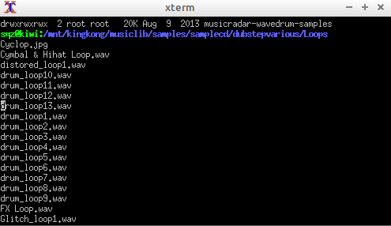

# audiobrowse.bash
simple commandline audio preview of directories for sample-artists / musician and producers

# Why

Because simple audition of directories should be possible using easy peasy arrowkeys & pressing enter.

# Installation 

In your terminal type:

     wget "https://github.com/coderofsalvation/audiobrowse.bash/raw/master/audiobrowse.bash"
     chmod 755 audiobrowse.bash
     ./audiobrowse.bash

# Features

* tries to play .wav .mp3 .aiff .flac .ogg and such (if playback tools are available)
* easy navigation using pagedown/pageup + arrowkeys

# Dependancies

* bash (so any *NIX system)

# Hint

copy audiobrowse.bash to ~/bin and add ~/bin to your PATH like so:

    export PATH=$PATH:~/bin

This way you can type 'audiob<TAB>' from any directory

# Credits 

audiobrowse.bash was built upon the [lscd project](https://github.com/hut/lscd)

