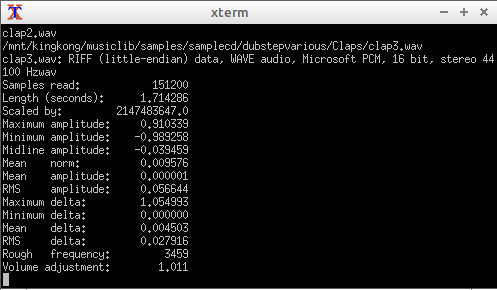

# audiobrowse.bash
simple commandline audio preview of directories for sample-artists / musician and producers

# Why

Because deadsimple audition of directories with samples should be easy peasy like so:

# Installation 

In your terminal type:

     wget "https://github.com/coderofsalvation/audiobrowse.bash/raw/master/audiobrowse.bash"
     chmod 755 audiobrowse.bash
     ./audiobrowse.bash

# Features

* pressing enter tries to play the audio (when playback utils are available)
* easy directory navigation using arrowkeys + '.' (=directory up)
* pressing '?' will give statistics on the current file
* pressing 'c' will copy selected file to particular dir (prompted once)
* pressing 'f' will filter results

# Dependancies

* bash (so any *NIX system)

# Hint

Install the 'sox' and 'mpg123' for stats and mp3-playback.

copy audiobrowse.bash to ~/bin and add ~/bin to your PATH like so:

    export PATH=$PATH:~/bin

This way you can type 'audiob<TAB>' from any directory

# Credits 

audiobrowse.bash was built upon the [lscd project](https://github.com/hut/lscd)

